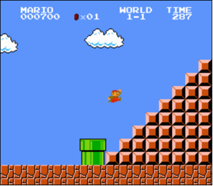

# THE PROBLEM

Toward the end of World 1-1 in Nintendo’s Super Mario Bros., Mario must ascend right-aligned pyramid of bricks, as in the below.



## Your task

In a file called `mario.cpp` in the src folder you will implement a program in C++ that recreates the pyramid using hashes (`#`) for bricks as shown below

```plaintext
       #
      ##
     ###
    ####
   #####
  ######
 #######
########
```

But you will prompt the user for an `int` so that you can control the pyramids height. i.e

```plaintext
Enter your desired pyramid height: 3
  #
 ##
###
```

Remember a basic CPP program looks like this

```cpp
#include <iostream>

int main(void)
{
    // Your Code here

}
```

> Make sure you try and learn by googling and through grit. GPT can easily solve this problem, but we hired you, not it.
